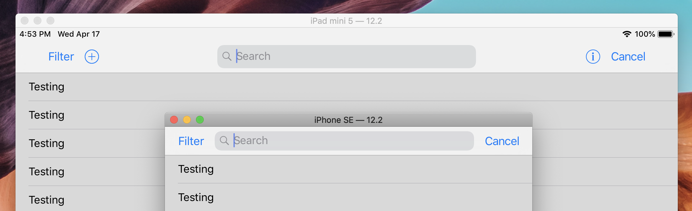

# IXSearchController
A custom search controller that allow adding additional buttons to search bar, just like App Store on iPad.




## Installation

I don't think I need to make a framework just for this, so this is a single file "framework" for y'all.

Just drag `IXSearchController.swift` to your project, no need to import.

## Usage

Using `IXSearchController` is just like using `UISearchController`:

```swift
let searchController = IXSearchController(searchResultsController: nil)
navigationItem.searchController = searchController
```

### Adding Button

You can add buttons to the left or right side of the search bar using `leftBarItemsStack` or `rightBarItemsStack`. It's as easy as adding view to a stack view:

```swift
let filterButton = UIButton(type: .system)
filterButton.setTitle("Filter", for: .normal)
filterButton.titleLabel?.font = UIFont.systemFont(ofSize: UIFont.buttonFontSize)
filterButton.setContentCompressionResistancePriority(.required, for: .horizontal)

searchController.leftBarItemsStack.addArrangedSubview(filterButton)
```

By default, a cancel button is inserted right-most to `rightBarItemsStack`. You can disable this behavior by setting:

```swift
searchController.autoInsertCancelButton = false
```

> For those buttons you added to the stack view, it's your responsibility to set its content compression resistance priority.
>
> For god's sake, you should avoid adding too mach buttons to the search bar.

### Constraint Search Bar's Width on iPad

You can set a maximum width for the search bar:

```swift
searchController.maxSearchBarWidthWhenActive = 400
```

The search bar will be display horizontally centered.

In addition to this, you can add extra spacing arround bar items stack:

```swift
searchController.extraBarItemSpacing = 30
```

## Known Issues

- **Layout and animation glitch when activating search bar for the first time.**

  When `hidesNavigationBarDuringPresentation` is set to `true`, there will be a layout glitch when activating search bar for the first time. This may because apple lazy-loaded search controller and use some custom view for visual before activating it.

  I didn't find a way to fix this yet, any pull request is welcome. But there's a temporary fix.

  First, set `skipFirstTwoTransition` to `true`, so it will animate first two transitions in very short duration:

  ```swift
  searchController.skipFirstTwoTransition = true
  ```

  Then, manually activate and deactivate search bar to force it to load:

  ```swift
  override func viewDidAppear(_ animated: Bool) {
    searchController.isActive = true
    searchController.isActive = false
  }
  ```

- **Layout glitches when hiding search bar by scrolling.**

  When `hidesSearchBarWhenScrolling` is set to `true`, there's a little glitch when navigation bar shrink after a transition happened. 